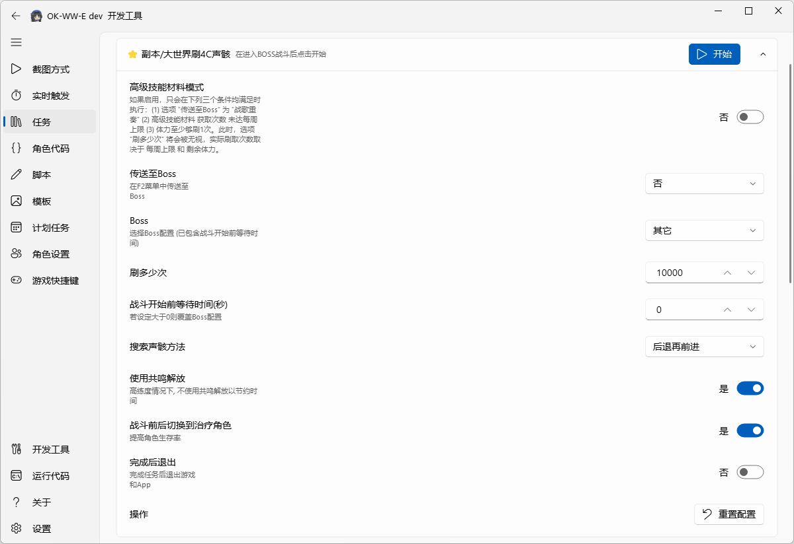

# ok-ww enhanced

[English](README_en.md) | [中文](README.md) | 日本語

### 概要

[オリジナル版 ok-ww](https://github.com/ok-oldking/ok-wuthering-waves) のすべての機能を維持したうえで、**新しい日課一括タスクを追加し、タスクの堅牢性とログの可読性を向上させ、無人実行とデバッグをしやすくしています。**

コード変更: https://github.com/zzc-tongji/ok-ww-enhanced/compare/master..main?diff=split 。

ビルド方法の変更: [build.diff.html](https://htmlpreview.github.io/?https://raw.githubusercontent.com/zzc-tongji/ok-ww-enhanced/refs/heads/main/readme/build.diff.html) 。

### 新機能

追加された機能はすべて ⭐ で示しています。




#### 新しいスタミナタスク（無音区、凝素領域、シミュレーション領域）

- 周回回数の設定に対応:
  - 周回しない場合は 0 に設定します。すべてのスタミナを使い切りたい場合は大きな数値に設定します。
  - 周回回数は 1 倍（最低）スタミナで計算されます。2 倍スタミナでの周回にも対応しており、その場合の周回回数は 2 として数えます。
  - 実装方法は use_stamina 関数の注入です。注入前後の比較はこちらです: [use_stamina.diff.html](https://htmlpreview.github.io/?https://raw.githubusercontent.com/zzc-tongji/ok-ww-enhanced/refs/heads/main/readme/use_stamina.diff.html) 。

#### 新しい日課一括タスク

- 新しいスタミナタスク（無音区、凝素領域、シミュレーション領域）を使用します。各スタミナタスクごとに周回回数を個別に設定でき、周回のスキップやすべてのスタミナ消費に対応しています。
- リトライ回数の設定に対応しています（各タスクに個別に適用）。リトライ回数を使い切っても完了できない場合は、ログを記録して **スクリーンショット** を保存します。
- ログファイル `./logs/ok-script.log` の改善:
  - 一部のタスクを完了できない場合、後続処理（通知送信など）のためにテキスト `未完成` が含まれます。
  - 例外が発生した場合、後続処理のためにテキスト `一条龙错误` とエラースタックが含まれます。
- 新しい [DailyTask2.py](./src/task/DailyTask2.py) とオリジナル版 [DailyTask.py](./src/task/DailyTask.py) の違い:
  - オリジナル版と比べて、新版ではタスクのリトライ、例外ログ、例外時のスクリーンショットを追加しています。
  - 例外が発生した場合、新版ではプログラムを終了するかどうかを設定できますが、オリジナル版では終了しません。
  - コード変更レポート: [DailyTask.diff.html](https://htmlpreview.github.io/?https://raw.githubusercontent.com/zzc-tongji/ok-ww-enhanced/refs/heads/main/readme/DailyTask.diff.html) 。

### 実行方法

#### GUI で実行

[Release](https://github.com/zzc-tongji/ok-wuthering-waves-enhanced/releases) から最新の `ok-ww-e-win32-Global-setup.exe` をダウンロードし、ダブルクリックしてインストールします。

#### CLI で実行

[Release](https://github.com/zzc-tongji/ok-wuthering-waves-enhanced/releases) から最新の `ok-ww-e-win32-Global-setup.exe` をダウンロードし、ダブルクリックしてインストールします。

```pwsh
cd "<ok-ww-e-installation-directory>\data\apps\ok-ww-e\working"

# 起動後にタスク 1（新しい日課一括タスク）を自動実行し、タスク完了後にプログラムを終了します。
ok-ww-e.exe -t 1 -e

# 起動後にタスク 5（オリジナル版の日課一括タスク）を自動実行し、タスク完了後にプログラムを終了します。
ok-ww-e.exe -t 5 -e
```

*   `-t` または `--task` - 起動後に N 番目のタスクを自動実行します。
*   `1` - タスクリスト（[config.py -> onetime_tasks](https://github.com/zzc-tongji/ok-wuthering-waves-enhanced/blob/main/config.py#L165)）内の 1 番目のタスクです。
*   `-e` または `--exit` - タスク実行完了後にプログラムを自動終了します。

#### ソースコードから実行

依存関係は [miniconda](https://www.anaconda.com/docs/getting-started/miniconda/main) の仮想環境にインストールすることをおすすめします。

``` powershell
# requirement
conda create --name okww python=3.12 pip=25.0
pip install -r requirements.txt --upgrade
pip install -r requirements-dev.txt --upgrade

# release
python main.py

# debug
python main_debug.py
```

#### VSCode での開発とデバッグ

https://github-com.translate.goog/ok-oldking/ok-wuthering-waves/discussions/934?_x_tr_sl=zh-CN&_x_tr_tl=jp

#### COCO 特徴プレビュー

`assets/coco_annotations.json` の画像特徴は、以下のリンクからプレビューできます（継続的に更新）:

https://htmlpreview.github.io/?https://raw.githubusercontent.com/zzc-tongji/ok-ww-e-coco-preview/refs/heads/main/data/index.html

### ヒント

- ok-ww-e はゲームのホットアップデート後にゲームを再起動できますが、`設定 / 基本設定 / ゲーム終了時にアプリを自動終了` をオフにする必要があります。
- ok-ww-e がゲームを起動できない場合は、まず管理者として起動してみてください。うまくいかない場合は、管理者モードの cmd コマンドラインから `cmd /c start "" ok-ww-e.exe` を実行してください。

### 免責事項

本ソフトウェアは、鳴潮のゲームプレイを自動化することを目的とした外部ツールです。既存のユーザーインターフェースのみを通じてゲームと連携し、関連する法令を遵守します。本ソフトウェアパッケージは、ユーザーとゲームのやり取りを簡略化するためのものであり、ゲームバランスを損なったり、不公平な優位性を提供したりするものではありません。また、いかなるゲームファイルやコードも変更しません。

本ソフトウェアはオープンソースかつ無料であり、個人の学習および交流のみに使用でき、個人のゲームアカウントに限って利用できます。商業目的または営利目的で使用してはなりません。開発チームは本プロジェクトの最終的な解釈権を有します。本ソフトウェアの使用によって生じるすべての問題は、本プロジェクトおよび開発チームとは無関係です。業者が本ソフトウェアを使用して有料の代行プレイを行っている場合、それは業者個人の行為です。本ソフトウェアは代行プレイサービスでの使用を許可しておらず、それにより生じる問題および結果は本ソフトウェアとは無関係です。本ソフトウェアはいかなる人物にも販売を許可していません。販売されているソフトウェアには悪意のあるコードが混入され、ゲームアカウントや PC のデータが盗まれる可能性がありますが、それは本ソフトウェアとは無関係です。

Kuro の『鳴潮』フェアプレイ宣言では、以下のように定められています:

```
ゲーム体験を破壊するいかなるサードパーティ製ツールの使用も厳禁です。
外挂、アクセラレーター、チートソフトウェア、マクロスクリプトなどの違反ツールの使用を厳しく取り締まります。これらの行為には、自動放置、スキル加速、無敵モード、瞬間移動、ゲームデータの改変などの操作が含まれますが、これらに限定されません。
確認された場合、違反の状況と回数に応じて、違反収益の差し引き、ゲームアカウントの凍結または永久停止などを含む措置を講じますが、これらに限定されません。
```

------

# README of ok-ww

------

<div align="center">
  <h1 align="center">
    
    <br/>
    ok-ww
  </h1> 
  
  <p>
    <a href="https://github.com/ok-oldking/ok-script">ok-script</a> で開発された、鳴潮（Wuthering Waves）向けの画像認識ベースの自動化ツールです。バックグラウンドモードに対応しています。
  </p>
  
  <p><i>Windows のユーザーインターフェースをシミュレートして動作し、メモリの読み取りやファイルの改変は一切行いません。</i></p>
</div>

<!-- Badges -->
<div align="center">
  

[](https://github.com/ok-oldking/ok-wuthering-waves/releases)
[](https://github.com/ok-oldking/ok-wuthering-waves/releases)
[](https://discord.gg/vVyCatEBgA)

</div>

**デモ＆チュートリアル:** [](https://youtu.be/h6P1KWjdnB4)

---

## ⚠️ 免責事項

本ソフトウェアは、鳴潮のゲームプレイの一部を自動化するために設計された外部補助ツールです。関連する法令を遵守し、標準的なユーザーインターフェース操作のシミュレートのみによってゲームと連携します。本プロジェクトはユーザーの反復的な作業を簡略化することを目的としており、ゲームバランスを損なったり、不公平な優位性を提供したりするものではありません。ゲームのファイルやデータを改変することは決してありません。

本ソフトウェアはオープンソースかつ無料であり、個人の学習および交流のみを目的としています。商業目的や営利目的の活動には使用しないでください。開発チームは最終的な解釈権を留保します。本ソフトウェアの使用によって生じたいかなる問題についても、本プロジェクトおよびその開発者は責任を負いません。

なお、Kuro Games 公式による鳴潮のフェアプレイ宣言では、以下のように定められています:
> ゲーム体験を妨害するサードパーティ製ツールの使用は固く禁止されています。
> チート、スピードハック、チートソフトウェア、マクロスクリプトなどの不正なツールの使用に対しては、厳格な措置を講じます。これには、自動周回、スキル加速、無敵化、テレポート、ゲームデータの改変などが含まれますが、これらに限定されません。
> 違反が確認された場合、その重大性と頻度に応じて、不正に得た利益の没収、ゲームアカウントの一時停止または永久凍結などを含む（ただしこれらに限定されない）処罰を科します。

**本ソフトウェアを使用することにより、あなたは上記の声明を読み、理解し、同意したものとみなされ、起こりうるすべてのリスクを自らの意思で負うことになります。**

## 🚀 クイックスタート

1.  **インストーラーのダウンロード**: 下記の「ダウンロード」セクションから、最新の `ok-ww-win32-setup.exe` インストーラーファイルをダウンロードします。
2.  **プログラムのインストール**: `ok-ww-win32-setup.exe` ファイルをダブルクリックし、画面の指示に従ってインストールを完了します。
3.  **プログラムの実行**: インストール後、デスクトップのショートカットまたはスタートメニューから `ok-ww` を起動します。

## 📥 ダウンロード

*   **[GitHub](https://github.com/ok-oldking/ok-wuthering-waves/releases)**: 公式リリースページ。世界中から高速にアクセスできます。（**`Source Code` のアーカイブではなく、`setup.exe` インストーラーをダウンロードしてください**）。

## ✨ 主な機能


*   **高解像度対応**: 4K までのすべての 16:9 解像度（最低 1600x900）でスムーズに動作します。一部の機能は 21:9 などのウルトラワイド解像度にも対応しています。
*   **バックグラウンドモード**: ゲームウィンドウが最小化されていたり、他のウィンドウに隠れていたりしてもバックグラウンドで動作するため、PC を他の作業に使えます。
*   **インテリジェント認識**: すべてのキャラクターを自動的に認識するため、スキルシーケンスを手動で設定する必要がありません。ワンクリックで開始できます。
*   **自動ミュート**: バックグラウンドで動作している間、ゲームの音声を自動的にミュートできます。

## 🔧 トラブルシューティング

問題が発生した場合は、サポートを求める前に以下の手順を一つずつ確認してください:

1.  **インストールパス**: ソフトウェアが**英数字のみ**を含むパス（例: `D:\Games\ok-ww`）にインストールされていることを確認してください。`C:\Program Files` や、英語以外の文字を含むフォルダーにはインストールしないでください。
2.  **アンチウイルスソフト**: ファイルが誤って削除またはブロックされるのを防ぐため、ソフトウェアのインストールディレクトリをアンチウイルスソフト（Windows Defender を含む）の**例外またはホワイトリスト**に追加してください。
3.  **ディスプレイ設定**:
    *   グラフィックカードのフィルター（NVIDIA Game Filter など）やシャープニング機能をすべてオフにしてください。
    *   ゲームのデフォルトの明るさ設定を使用してください。
    *   ゲーム画面上に情報を表示するオーバーレイ（MSI Afterburner や Fraps などのフレームレート表示等）を無効にしてください。
4.  **カスタムキー設定**: ゲーム内のデフォルトのキー設定を変更している場合は、`ok-ww` の設定でも同様に更新する必要があります。設定に記載されているキー設定のみがサポートされています。
5.  **ソフトウェアのバージョン**: 最新バージョンの `ok-ww` を使用していることを確認してください。
6.  **ゲームのパフォーマンス**: ゲームが **60 FPS** で安定して動作することを確認してください。フレームレートが不安定な場合は、ゲームのグラフィック品質や解像度を下げてみてください。
7.  **ゲームの接続切断**: サーバーから頻繁に切断される場合は、ツールを起動する前に手動でゲームを起動し、5分ほどプレイしてみてください。切断された場合は、ゲームを閉じずにそのまま再ログインしてください。
8.  **サポートを受ける**: 上記の手順で問題が解決しない場合は、コミュニティチャンネルを通じて詳細なバグレポートを提出してください。

---

## 💻 開発者向け

### ソースコードからの実行（Python）

本プロジェクトは Python 3.12 のみをサポートしています。

```bash
# 依存関係のインストールまたは更新
pip install -r requirements.txt --upgrade

# リリース版の実行
python main.py

# デバッグ版の実行
python main_debug.py
```

### コマンドライン引数

コマンドライン引数を使用して自動起動できます。

```bash
# 例: 起動後に最初のタスクを自動実行し、完了したらプログラムを終了する
ok-ww.exe -t 1 -e
```

*   `-t` または `--task`: 起動後にリストの N 番目のタスクを自動的に実行します。`1` は最初のタスクを表します。
*   `-e` または `--exit`: タスクの完了後にプログラムを自動的に終了します。

## 💬 参加しよう

本プロジェクトは [ok-script](https://github.com/ok-oldking/ok-script) フレームワークをベースに開発されています。コアコードはわずか約 3000 行（Python）で、シンプルでメンテナンスしやすい構成です。独自の自動化プロジェクトを作成したい開発者の方は、ぜひ [ok-script](https://github.com/ok-oldking/ok-script) をご利用ください。

## 🔗 ok-script を使用しているプロジェクト:

*   鳴潮（Wuthering Waves）: [https://github.com/ok-oldking/ok-wuthering-waves](https://github.com/ok-oldking/ok-wuthering-waves)
*   原神（メンテナンス終了。ただしバックグラウンドでの会話自動スキップには引き続き使用可能）: [https://github.com/ok-oldking/ok-genshin-impact](https://github.com/ok-oldking/ok-genshin-impact)
*   ドールズフロントライン2: [https://github.com/ok-oldking/ok-gf2](https://github.com/ok-oldking/ok-gf2)
*   崩壊：スターレイル: [https://github.com/Shasnow/ok-starrailassistant](https://github.com/Shasnow/ok-starrailassistant)
*   スターレゾナンス: [https://github.com/Sanheiii/ok-star-resonance](https://github.com/Sanheiii/ok-star-resonance)
*   デュエットナイトアビス: [https://github.com/BnanZ0/ok-duet-night-abyss](https://github.com/BnanZ0/ok-duet-night-abyss)
*   アッシュエコーズ（更新停止）: [https://github.com/ok-oldking/ok-baijing](https://github.com/ok-oldking/ok-baijing)


## ❤️ スポンサーと謝辞

### スポンサー
*   **EXE 署名**: [SignPath.io](https://signpath.io/) による無料のコード署名、証明書は [SignPath Foundation](https://signpath.org/) より提供。

### 謝辞
*   [lazydog28/mc_auto_boss](https://github.com/lazydog28/mc_auto_boss)
*   [ok-oldking/OnnxOCR](https://github.com/ok-oldking/OnnxOCR)
*   [zhiyiYo/PyQt-Fluent-Widgets](https://github.com/zhiyiYo/PyQt-Fluent-Widgets)
*   [Toufool/AutoSplit](https://github.com/Toufool/AutoSplit)
